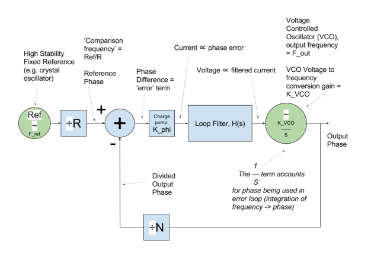

以下是PLL电路系统的一个简图

**Ref:** 输入的参照频率，会与后面经过VCO调整输出的频率作比较，会经过一个R divider

**K_VCO:** conversion gain,是VCO 中 频率与电压的一个比值关系（非线性）

**loop filter**: The loop filter acts to slow the response down. The narrower the loop bandwidth, i.e. the lower the cut-off frequency of the filter, the slower the response of the loop to responding to changes. Conversely if the loop requires a fast response to changes in frequency, then it will need a wide loop bandwidth.
PREVIOUS PAGE, it can also smooth the current pulse

**N:** N divider,used to divide the output frequency down from the VCO

**VCO**: 频率由电压控制的振荡器

**charge pump:** A PLL charge pump is merely a bipolar switched current source. This means that it can output positive and negative current pulses into the loop filter of the PLL. It cannot produce higher or lower voltages than its power and ground supply levels.

**phase lock:** 在上图中，当 F_out/N=F_ref/R的时候称之为phase lock,此时频率下相等也就是所谓的phase difference相等，phase error为0